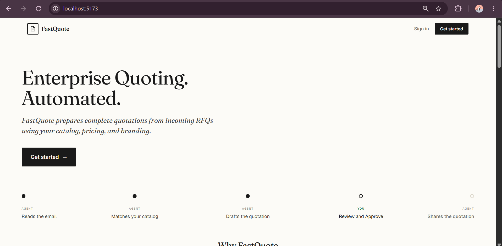

# Email Agent — Dashboard (Frontend)

The web dashboard for the email quotation agent: business owners sign in with
Google, complete a self‑serve onboarding, and watch how the agent is handling
their quote requests.

> **Live app:** _https://email-agent-frontend-delta.vercel.app/_

It is a **static single‑page app**. It has no backend of its own — it talks to
the **BFF** over HTTP. **BFF = Backend for Frontend**: a backend dedicated to
this UI that exposes exactly the endpoints it needs (auth, metrics, onboarding,
uploads) and hides everything else — Postgres, Gmail, the agent daemon — behind
it. The whole UI can also run with **zero backend** in a bundled demo mode,
which makes local development and previews trivial.

## Landing Page Redesign


Changes made:
- Sticky nav with scroll blur
- Added product mockup visual to hero
- Unified card design system across How It Works / Trust / Benefits
- Added gradient accent to final CTA
- Verified responsive at mobile/tablet/desktop breakpoints

---

## Tech stack

| Concern | Choice |
|---|---|
| Build | **Vite** |
| UI | **React 19** + **TypeScript** |
| Styling | **Tailwind CSS v3** + hand‑rolled shadcn‑style primitives (`src/components/ui`) |
| Charts | **Recharts** |
| Icons | **lucide-react** · Dates **date-fns** · Font **Geist** |
| Auth | **Google Identity Services** (loaded client‑side) |
| Routing | none — a single page with a `view` state (Overview / Catalog / Settings) |
| Lint | **oxlint** |

Output of `npm run build` is a static `dist/` (HTML/CSS/JS) — deployable to any
static host (we use **Vercel**).

---

## How it fits in the system


The UI only ever calls the **BFF**. It never touches Postgres, Gmail, or the
agent daemon directly. Tenant isolation and all business logic live server‑side;
the UI just carries a tenant‑scoped session token.

---

## Two runtime modes (set by `VITE_API_BASE_URL`)

| `VITE_API_BASE_URL` | Mode | Behaviour |
|---|---|---|
| _unset / empty_ | **Demo** | Serves bundled fixtures (`src/lib/fixtures.json`, `catalog-fixture.json`); login is bypassed; onboarding is simulated. No backend needed. |
| `/` | **Live, same‑origin** | Relative API calls (no CORS) — for when the BFF also serves the UI. |
| full URL (e.g. `https://bff.example.com`) | **Live, cross‑origin** | Calls that base verbatim. This is the Vercel → BFF setup (needs CORS on the BFF). |

The live/demo switch is `IS_LIVE` in `src/lib/api.ts` (derived from
`VITE_API_BASE_URL`). **Demo mode is the default** — run it with no env at all.

---

## Running locally

```bash
npm install

# Demo mode — no backend, sample data, login bypassed:
npm run dev                     # → http://localhost:5173

# Live mode — against a running BFF:
cat > .env.local <<'EOF'
VITE_API_BASE_URL=http://localhost:8787
VITE_GOOGLE_CLIENT_ID=<your Google WEB OAuth client id>
EOF
npm run dev                     # restart after any .env.local change (Vite bakes env at start)

npm run build                   # production build → dist/
npm run preview                 # serve the built dist/ locally
npm run lint                    # oxlint
```

### Environment variables

| Var | Required | Meaning |
|---|---|---|
| `VITE_API_BASE_URL` | live only | BFF base URL. Unset = demo. `/` = same‑origin. Full URL = cross‑origin. |
| `VITE_GOOGLE_CLIENT_ID` | live only | Google **Web** OAuth **client id** (public). Used for login and the Gmail‑connect popup. Must match the id the BFF verifies. |
| `VITE_GMAIL_CLIENT_ID` | optional | Defaults to `VITE_GOOGLE_CLIENT_ID`. Only if the Gmail‑connect client differs from the login client. |

> There is **no client secret** in the frontend. Client ids are public and safe
> to ship in the bundle.

---

## Project structure

```
src/
├── App.tsx                 # shell: auth gate → onboarding gate → dashboard views
├── main.tsx                # providers: ThemeProvider + AuthProvider
├── lib/
│   ├── api.ts              # ALL backend calls (+ demo fallbacks); IS_LIVE/IS_DEMO; 401 → login
│   ├── auth.tsx            # AuthProvider / useAuth; session in localStorage
│   ├── google.ts           # loads Google Identity Services once (login + gmail connect)
│   ├── metrics-contract.ts # zod types mirroring the BFF's response shapes
│   └── fixtures.json,
│       catalog-fixture.json# demo data for offline preview
├── components/
│   ├── top-bar.tsx         # brand + nav (Overview/Catalog/Settings) + status pill + sign out
│   ├── login.tsx           # Google Sign‑In gate
│   ├── onboarding/         # the first‑login wizard (profile → gmail → upload)
│   ├── dashboard/          # kpi-cards, charts (metric dropdown + funnel), lists, health
│   ├── settings/           # reviewer email + uploaded‑data tree
│   ├── catalog/            # catalog viewer (fixture‑backed for now)
│   ├── file-tree.tsx       # recursive upload tree
│   └── ui/                 # primitives (button, card, table, tabs, input, badge, …)
```

### The API layer (`src/lib/api.ts`)

Every network call lives here. Each function has a **demo fallback** so the UI
works with no backend. Endpoints it talks to on the BFF:

- `POST /auth/session` — exchange a Google ID token for a session
- `GET  /v1/tenants/{id}/metrics/overview` · `/conversations` · `/quotations` · `/review-queue`
- `GET/PUT /v1/tenants/{id}/settings/reviewer-email`
- `GET  /v1/tenants/{id}/onboarding` · `PUT …/onboarding/profile` · `POST …/onboarding/complete`
- `POST /v1/tenants/{id}/gmail/connect`
- `PUT  /v1/tenants/{id}/uploads?filename=…` (raw body) · `GET …/uploads`

The **session token** (from `/auth/session`) is stored in `localStorage` and sent
as `Authorization: Bearer …`. A **401** clears the session and bounces the user to
login (session TTL is 12h server‑side).

### The data contract (`src/lib/metrics-contract.ts`)

This is a **hand‑kept mirror** of the BFF's zod contract. If the backend contract
changes, update this file to match. (Both derive from the same spec in the
backend repo.)

---

## Auth & onboarding flow

1. **Login** — `login.tsx` renders the Google button (GIS) → gets a Google ID
   token → `POST /auth/session` → the BFF verifies it, maps the email to a tenant
   via a fail‑closed allowlist, and returns a signed session.
2. **Onboarding gate** — `App.tsx` fetches onboarding status; if the tenant isn't
   onboarded it shows the **wizard**: business profile → **Connect Gmail** (Google
   OAuth popup) → **upload catalog data** → finish (each step gates the next).
3. **Dashboard** — KPIs, an activity chart (metric dropdown), an outcome funnel,
   recent conversations/quotations/review‑queue, and a settings page.

> Approving quotes is **not** in the dashboard — that stays on the email reply
> flow by design.

---

## Deploying (Vercel)

- Static SPA; **root directory = repo root**. `vercel.json` handles SPA rewrites
  and the Vite build.
- Set `VITE_API_BASE_URL` (the BFF URL) and `VITE_GOOGLE_CLIENT_ID` in the Vercel
  project for live mode. Leave them unset to ship a demo build.
- In Google Cloud Console, add the Vercel origin to the **Web** OAuth client's
  **Authorized JavaScript origins**, and set the BFF's `METRICS_CORS_ORIGIN` to
  the Vercel origin.

---

## Gotchas (read before your first change)

- **Vite bakes env at start** — restart `npm run dev` after editing `.env.local`.
- **Google login origins are exact** — `http://localhost:5173` must be in the Web
  client's Authorized JS origins, and `localhost` ≠ `127.0.0.1` to Google.
- **Demo vs live** is entirely `VITE_API_BASE_URL`; the rest of the code doesn't
  branch on hostnames.
- **CORS only exists in cross‑origin mode.** Same‑origin (`/`) and demo have none.
- Keep `src/lib/metrics-contract.ts` in sync with the backend contract.
